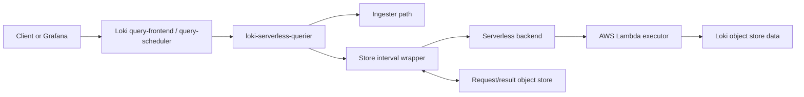

# Loki Serverless Querier

`loki-serverless-querier` extends Grafana Loki's query path with serverless
execution for cold store queries. It runs as a Loki-version-bound querier beside
the native querier, accepts the same query work from Loki's HTTP,
query-frontend, or query-scheduler paths, and offloads store-only query
intervals to a remote execution backend.

The first supported backend is AWS Lambda. The internal execution layer keeps
provider-specific code behind a backend interface, so the Loki store wrapper and
query orchestration do not depend directly on AWS-specific wiring.

## Why

Loki queriers are long-running services. Scaling them for occasional large cold
log investigations usually means adding more servers or pods, then waiting for
capacity to become ready.

This project targets a different shape:

- keep the normal Loki query path and query-frontend/query-scheduler semantics
- run hot or ingester-backed intervals locally in Loki
- offload cold store intervals to serverless workers
- keep a single container image for both the persistent querier and the remote
  executor
- scale cold query compute without permanently running a large querier fleet

## How It Works



`loki-serverless-querier` is built from a specific Loki version plus a small
overlay. In `serverless-querier` mode, it execs the Loki binary from the same
image and defaults Loki's target to `querier`. The overlay wraps Loki's store
query path, converts store-only `SelectLogs` and `SelectSamples` calls into a
versioned protocol, and sends them to a remote backend.

The remote executor runs the same image in `lambda-executor` mode. It loads the
same Loki storage configuration, disables recursive serverless wrapping, and
executes the native Loki store-only query logic.

## Features

- Loki-version-bound build overlay
- one image, two startup modes
- native Loki HTTP, query-frontend worker, and query-scheduler worker behavior
- provider-neutral remote execution interface
- AWS Lambda backend
- S3 request/result object references for payloads that do not fit inline
- synchronous remote execution only
- interval splitting before invocation
- retry by splitting failed intervals down to a minimum interval
- optional local store fallback on remote execution failure
- protocol versioning tied to the Loki image version

## Current Status

This project is experimental. It is intended for validation of the serverless
querier architecture and cold store query acceleration.

Implemented:

- Loki `v3.7.1` overlay
- AWS Lambda remote execution backend
- S3 object store references
- log query and sample query store wrapper
- local build and smoke-test workflow

Not yet complete:

- production deployment manifests
- full query equivalence test suite against real Loki S3 data
- remote executor cold-start optimization
- operational dashboards and alerts

## Compatibility

Each image is built against one Loki version. The default version is:

```text
v3.7.1
```

Version-specific Loki patches live under `patches/<LOKI_VERSION>/`. Upgrading
Loki should be done by adding or updating a version-specific patch directory and
running the overlay build checks.

## Quick Start on AWS

The default deployment path uses published artifacts:

- one published `loki-serverless-querier` image for the persistent querier
- one published Lambda zip for the `provided.al2023` executor
- one AWS Lambda function running the executor
- one persistent `loki-serverless-querier` deployment running the image with
  `-mode=serverless-querier`
- one S3 bucket/prefix for request and result payload references
- an existing Loki object store and schema configuration

### 1. Set Deployment Variables

Choose artifacts built for the same Loki version:

```bash
AWS_REGION=us-east-1
AWS_ACCOUNT_ID="$(aws sts get-caller-identity --query Account --output text)"

PROJECT_OWNER=zhiyu0729
PROJECT_VERSION=v0.1.0
LOKI_VERSION=v3.7.1
LAMBDA_ARCH=arm64

IMAGE_URI="ghcr.io/$PROJECT_OWNER/loki-serverless-querier:loki-$LOKI_VERSION-$PROJECT_VERSION"
LAMBDA_ZIP="loki-serverless-querier-lambda-$LAMBDA_ARCH.zip"

LAMBDA_FUNCTION=loki-store-query
LAMBDA_ROLE_NAME=loki-store-query-lambda
QUERIER_ROLE_NAME=loki-serverless-querier

LOKI_DATA_BUCKET=loki-data-bucket
RESULT_BUCKET=loki-serverless-query-results
RESULT_PREFIX=loki-serverless-querier
```

Create the request/result bucket if it does not already exist in your account:

```bash
if aws s3api head-bucket --bucket "$RESULT_BUCKET" 2>/dev/null; then
  echo "Using existing bucket: $RESULT_BUCKET"
else
  if [ "$AWS_REGION" = "us-east-1" ]; then
    aws s3api create-bucket --bucket "$RESULT_BUCKET" --region "$AWS_REGION"
  else
    aws s3api create-bucket \
      --bucket "$RESULT_BUCKET" \
      --region "$AWS_REGION" \
      --create-bucket-configuration LocationConstraint="$AWS_REGION"
  fi
fi
```

Initialize and verify the request/result prefix. S3 prefixes are virtual, so
this marker object is only a deployment-time sanity check that the prefix value
is correct and the bucket is writable:

```bash
aws s3api put-object \
  --bucket "$RESULT_BUCKET" \
  --key "$RESULT_PREFIX/.keep" \
  --body /dev/null

aws s3api head-object \
  --bucket "$RESULT_BUCKET" \
  --key "$RESULT_PREFIX/.keep" >/dev/null
```

Configure lifecycle cleanup for request/result payloads. Tune the expiration
window for your operational needs; `7` days is a practical starting point for
debugging failed queries without keeping temporary objects forever:

```bash
cat > loki-serverless-lifecycle.json <<JSON
{
  "Rules": [
    {
      "ID": "expire-loki-serverless-query-payloads",
      "Status": "Enabled",
      "Filter": {
        "Prefix": "$RESULT_PREFIX/"
      },
      "Expiration": {
        "Days": 7
      },
      "AbortIncompleteMultipartUpload": {
        "DaysAfterInitiation": 1
      }
    }
  ]
}
JSON

aws s3api put-bucket-lifecycle-configuration \
  --bucket "$RESULT_BUCKET" \
  --lifecycle-configuration file://loki-serverless-lifecycle.json
```

Download the Lambda zip from the matching GitHub release:

```bash
curl -L \
  -o "$LAMBDA_ZIP" \
  "https://github.com/$PROJECT_OWNER/loki-serverless-querier/releases/download/$PROJECT_VERSION/$LAMBDA_ZIP"
```

### 2. Prepare the Lambda Loki Config

The Lambda executor must load a Loki config that can read the same cold object
store data as your normal querier. Keep the Lambda image immutable and provide
the config at runtime.

Example `lambda-config.yaml` shape:

```yaml
auth_enabled: true

server:
  http_listen_port: 3100
  grpc_listen_port: 9095

common:
  path_prefix: /tmp/loki
  replication_factor: 1
  ring:
    kvstore:
      store: inmemory

schema_config:
  configs:
    - from: 2024-01-01
      store: tsdb
      object_store: s3
      schema: v13
      index:
        prefix: index_
        period: 24h

storage_config:
  aws:
    s3: s3://us-east-1/loki-data-bucket
  tsdb_shipper:
    active_index_directory: /tmp/loki/tsdb-index
    cache_location: /tmp/loki/tsdb-cache

serverless_store:
  enabled: false
```

Encode the config and inject it as a Lambda environment variable:

```bash
CONFIG_B64="$(base64 < lambda-config.yaml | tr -d '\n')"
test "${#CONFIG_B64}" -le 3500 || {
  echo "lambda-config.yaml is too large for Lambda environment variables"
  exit 1
}
LAMBDA_ENV="$(printf '{"Variables":{"LOKI_SERVERLESS_QUERIER_CONFIG_B64":"%s"}}' "$CONFIG_B64")"
```

The Lambda executor decodes this value to a temporary file under `/tmp` during
startup and then loads it through Loki's normal `-config.file` path:

```text
LOKI_SERVERLESS_QUERIER_CONFIG_B64=<base64 encoded lambda-config.yaml>
```

If you mount a config file through another mechanism, such as EFS, use:

```text
LOKI_SERVERLESS_QUERIER_CONFIG_FILE=/path/to/config.yaml
```

For very small configurations, you can use
`LOKI_SERVERLESS_QUERIER_CONFIG_ARGS` instead. Keep the Lambda config minimal:
AWS Lambda environment variables have a small total size limit, and base64
encoding increases the size of the YAML content.

### 3. Create the Lambda Execution Role

Create the trust policy:

```bash
cat > lambda-trust-policy.json <<'JSON'
{
  "Version": "2012-10-17",
  "Statement": [
    {
      "Effect": "Allow",
      "Principal": {
        "Service": "lambda.amazonaws.com"
      },
      "Action": "sts:AssumeRole"
    }
  ]
}
JSON
```

Create the role and attach basic CloudWatch Logs permissions:

```bash
LAMBDA_ROLE_ARN="$(
  aws iam create-role \
    --role-name "$LAMBDA_ROLE_NAME" \
    --assume-role-policy-document file://lambda-trust-policy.json \
    --query 'Role.Arn' \
    --output text
)"

aws iam attach-role-policy \
  --role-name "$LAMBDA_ROLE_NAME" \
  --policy-arn arn:aws:iam::aws:policy/service-role/AWSLambdaBasicExecutionRole
```

Attach the Loki cold data and request/result object permissions:

```bash
cat > lambda-loki-policy.json <<JSON
{
  "Version": "2012-10-17",
  "Statement": [
    {
      "Effect": "Allow",
      "Action": ["s3:ListBucket"],
      "Resource": [
        "arn:aws:s3:::$LOKI_DATA_BUCKET",
        "arn:aws:s3:::$RESULT_BUCKET"
      ]
    },
    {
      "Effect": "Allow",
      "Action": ["s3:GetObject"],
      "Resource": "arn:aws:s3:::$LOKI_DATA_BUCKET/*"
    },
    {
      "Effect": "Allow",
      "Action": ["s3:GetObject", "s3:PutObject", "s3:DeleteObject"],
      "Resource": "arn:aws:s3:::$RESULT_BUCKET/$RESULT_PREFIX/*"
    }
  ]
}
JSON

aws iam put-role-policy \
  --role-name "$LAMBDA_ROLE_NAME" \
  --policy-name loki-store-query \
  --policy-document file://lambda-loki-policy.json
```

If your Loki storage uses KMS-encrypted buckets, add the required KMS permissions
for the same keys. IAM role propagation can take a few seconds:

```bash
sleep 10
```

### 4. Create the Lambda Function

Create the function from the `provided.al2023` zip package:

```bash
aws lambda create-function \
  --region "$AWS_REGION" \
  --function-name "$LAMBDA_FUNCTION" \
  --runtime provided.al2023 \
  --handler bootstrap \
  --zip-file "fileb://$LAMBDA_ZIP" \
  --role "$LAMBDA_ROLE_ARN" \
  --architectures "$LAMBDA_ARCH" \
  --timeout 900 \
  --memory-size 8192 \
  --ephemeral-storage '{"Size":10240}' \
  --environment "$LAMBDA_ENV"
```

Use `x86_64` instead of `arm64` if the zip was built with `TARGETARCH=amd64`.
When the binary starts inside Lambda and `AWS_LAMBDA_RUNTIME_API` is present, it
defaults to `lambda-executor` mode.

Optionally cap fan-out at the Lambda level:

```bash
aws lambda put-function-concurrency \
  --region "$AWS_REGION" \
  --function-name "$LAMBDA_FUNCTION" \
  --reserved-concurrent-executions 50
```

If you prefer Lambda container images, create the function with
`--package-type Image`, `--code ImageUri="$IMAGE_URI"`, and
`--image-config '{"Command":["-mode=lambda-executor"]}'`.

Smoke-test Lambda startup:

```bash
aws lambda invoke \
  --region "$AWS_REGION" \
  --function-name "$LAMBDA_FUNCTION" \
  --cli-binary-format raw-in-base64-out \
  --payload '{}' \
  /tmp/loki-serverless-lambda-smoke.json

cat /tmp/loki-serverless-lambda-smoke.json
```

A `bad_request` response saying that a request or request reference is required
is expected for this smoke test. It means the executor initialized and reached
the protocol handler.

Recommended starting values:

- timeout: `900`
- memory: `4096` to `8192`
- ephemeral storage: `10240`
- reserved concurrency: set this if you want a hard cap on query fan-out

### 5. Configure the Persistent Querier

Add `serverless_store` to the Loki config used by the persistent
`serverless-querier` deployment:

```yaml
serverless_store:
  enabled: true
  provider: aws-lambda

  aws:
    region: us-east-1
    lambda_function_name: loki-store-query

  object_store:
    type: s3
    bucket: loki-serverless-query-results
    prefix: loki-serverless-querier
    region: us-east-1

  max_interval: 15m
  min_interval: 1m
  max_concurrent: 16
  inline_request_limit_bytes: 4194304
  inline_response_limit_bytes: 4194304
  fallback_on_failure: true
```

The persistent querier's IAM role needs:

- `lambda:InvokeFunction` for the Lambda function
- `s3:GetObject`, `s3:PutObject`, and `s3:DeleteObject` for the request/result
  prefix
- normal Loki object store permissions if `fallback_on_failure` is enabled

Attach the invoke and request/result object permissions to the role used by the
persistent querier:

```bash
LAMBDA_FUNCTION_ARN="$(
  aws lambda get-function \
    --region "$AWS_REGION" \
    --function-name "$LAMBDA_FUNCTION" \
    --query 'Configuration.FunctionArn' \
    --output text
)"

cat > querier-serverless-policy.json <<JSON
{
  "Version": "2012-10-17",
  "Statement": [
    {
      "Effect": "Allow",
      "Action": "lambda:InvokeFunction",
      "Resource": "$LAMBDA_FUNCTION_ARN"
    },
    {
      "Effect": "Allow",
      "Action": ["s3:GetObject", "s3:PutObject", "s3:DeleteObject"],
      "Resource": "arn:aws:s3:::$RESULT_BUCKET/$RESULT_PREFIX/*"
    }
  ]
}
JSON

aws iam put-role-policy \
  --role-name "$QUERIER_ROLE_NAME" \
  --policy-name loki-serverless-query \
  --policy-document file://querier-serverless-policy.json
```

Run it as a querier:

```bash
docker run --rm \
  -p 3100:3100 \
  -v "$PWD/loki-config.yaml:/etc/loki/config.yaml:ro" \
  "$IMAGE_URI" \
  -mode=serverless-querier \
  -config.file=/etc/loki/config.yaml
```

It can be connected to query-frontend or query-scheduler with the same Loki
querier flags you already use. The frontend/scheduler does not need to know
which intervals are hot or cold.

### 6. Run a First Query

Choose a time range that is definitely in cold object storage, then query the
persistent serverless querier:

```bash
curl -G 'http://<serverless-querier>:3100/loki/api/v1/query_range' \
  -H 'X-Scope-OrgID: tenant-a' \
  --data-urlencode 'query={app="api"}' \
  --data-urlencode 'start=2026-04-01T00:00:00Z' \
  --data-urlencode 'end=2026-04-01T01:00:00Z' \
  --data-urlencode 'limit=100'
```

For validation, run the same query against a native Loki querier and compare the
result. Also check:

- Lambda CloudWatch Logs
- request/result objects under the configured prefix
- Loki querier logs for split, retry, and fallback behavior

## Run Modes

Persistent querier mode:

```bash
loki-serverless-querier \
  -mode=serverless-querier \
  -config.file=/etc/loki/config.yaml
```

AWS Lambda executor mode:

```bash
loki-serverless-querier -mode=lambda-executor
```

The container image uses `loki-serverless-querier` as its entrypoint. Pass Loki
configuration flags after the mode flags.

## Configuration

Enable serverless store execution in the persistent querier's Loki config:

```yaml
serverless_store:
  enabled: true
  provider: aws-lambda

  aws:
    region: us-east-1
    lambda_function_name: loki-store-query

  object_store:
    type: s3
    bucket: loki-serverless-query-results
    prefix: loki-serverless-querier
    region: us-east-1

  max_interval: 15m
  min_interval: 1m
  max_concurrent: 16
  inline_request_limit_bytes: 4194304
  inline_response_limit_bytes: 4194304
  fallback_on_failure: true
```

Equivalent flags are also registered under `serverless.store.*`, for example:

```bash
-serverless.store.enabled=true
-serverless.store.provider=aws-lambda
-serverless.store.aws.lambda-function-name=loki-store-query
-serverless.store.object-store.bucket=loki-serverless-query-results
```

The Lambda executor should receive a Loki config that can read the same cold
object store data. If the same config enables `serverless_store`, the executor
disables that wrapper internally to avoid recursive remote calls.

Lambda executor config sources, in precedence order:

- `LOKI_SERVERLESS_QUERIER_CONFIG_B64`: base64-encoded Loki YAML config,
  restored to `/tmp` before Loki is initialized
- `LOKI_SERVERLESS_QUERIER_CONFIG_ARGS`: inline Loki CLI flags for very small
  configs
- `LOKI_SERVERLESS_QUERIER_CONFIG_FILE`: local config file path, useful with EFS
  or local smoke tests
- command-line Loki flags passed after `-mode=lambda-executor`

## AWS Deployment Notes

For AWS validation, use the same application image for both services:

- ECS, Kubernetes, or another long-running environment for
  `-mode=serverless-querier`
- AWS Lambda `provided.al2023` zip or container image for the executor

Recommended Lambda settings for initial testing:

- architecture: match the image architecture
- timeout: 900 seconds
- memory: start with 4096 MB or 8192 MB
- ephemeral storage: start with 10 GB

The Lambda role needs permissions to:

- read Loki cold data from the configured object store
- read and write request/result objects under the configured prefix
- write CloudWatch Logs

The persistent querier role needs permissions to:

- invoke the Lambda function synchronously
- read and write request/result objects under the configured prefix
- read any Loki object store data needed for local fallback

AWS Lambda details to keep in mind:

- container images must be in ECR and in the same Region as the function
- the image or zip must target one architecture, either `arm64` or `x86_64`
- Lambda's maximum function timeout is 900 seconds
- Lambda environment variables have a 4 KB total size quota
- synchronous invoke request and response payloads are limited to 6 MB each
- writable local storage is under `/tmp`, configurable from 512 MB to 10,240 MB

References:

- [Create a Lambda function using a container image](https://docs.aws.amazon.com/lambda/latest/dg/images-create.html)
- [Lambda quotas](https://docs.aws.amazon.com/lambda/latest/dg/gettingstarted-limits.html)
- [Configure Lambda function timeout](https://docs.aws.amazon.com/lambda/latest/dg/configuration-timeout.html)
- [Configure ephemeral storage](https://docs.aws.amazon.com/lambda/latest/dg/configuration-ephemeral-storage.html)
- [Building Lambda functions with Go](https://docs.aws.amazon.com/lambda/latest/dg/lambda-golang.html)
- [Deploy Go Lambda functions with .zip file archives](https://docs.aws.amazon.com/lambda/latest/dg/golang-package.html)
- [Lambda Invoke API](https://docs.aws.amazon.com/lambda/latest/api/API_Invoke.html)

## Development Builds

Most users should start from a published image and Lambda zip. Build locally
only when changing the overlay or testing a Loki version that does not have a
published artifact yet.

Build the default Loki `v3.7.1` image:

```bash
make build-overlay LOKI_VERSION=v3.7.1 IMAGE=loki-serverless-querier:v3.7.1
```

For local development, build Linux binaries with the local Go toolchain and then
package them into the final image:

```bash
SKIP_FETCH=1 make build-overlay-local LOKI_VERSION=v3.7.1 IMAGE=loki-serverless-querier:v3.7.1
```

The local build strategy requires an existing Loki checkout under
`build/loki-v3.7.1`. Normal release builds should use `make build-overlay`.

Build an AWS Lambda zip package for the `provided.al2023` runtime:

```bash
make build-lambda-zip LOKI_VERSION=v3.7.1 TARGETARCH=arm64
```

The zip contains a single executable named `bootstrap` at the archive root.

## Validation

Run local checks:

```bash
make test
make verify
```

Smoke test the image:

```bash
docker run --rm loki-serverless-querier:v3.7.1 -mode=version
```

For real validation, compare native Loki querier and `loki-serverless-querier`
results over the same cold time range:

- log range query
- metric range query
- instant query
- forward and backward direction
- limit handling
- request object reference path
- result object reference path
- interval split and retry behavior

## Limitations

- Remote execution is synchronous only.
- The AWS Lambda backend is currently the only implemented backend.
- The remote executor currently initializes Loki modules through Loki's module
  manager, which can create server listeners during startup.
- Query equivalence must be validated against your own Loki schema, index type,
  limits, and object store data.
- Request/result object lifecycle cleanup is expected to be handled by object
  store lifecycle policies.

## Roadmap

- additional backend and object-store implementations as needed
- direct store-only executor initialization without Loki server modules
- production Helm or Jsonnet examples
- query equivalence fixtures
- metrics for remote invocations, split retries, fallback, and object store I/O

## License

This project builds on Grafana Loki source code. Review Loki's license terms and
your distribution obligations before publishing modified images or binaries.
